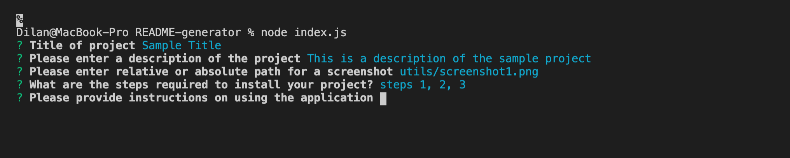

# README Generator

## Description
The README generator is a command-line application that helps developer quickly generate a professional looking README markdown file, so that they can focus their time on improving the actual appliction.

## Table of Contents  
- [Description](#description)
- [Installation and Usage](#installation-and-usage)
- [Video Demo of Application](#video-demo)
- [Additonal Notes](#additional-notes)

## Installation and Usage
- Clone this repository onto your computer
- Open terminal within the directory of the cloned repository
- Type  **npm i inquirer**  in the terminal. The inquirer package is required for this application
- After the inquirer package is installed, evoke the application by typing  **node index.js**  in the command
- You will then be asked a series of questions. Answer the questions carefully as your answers will become the content of the README file under according titles
- When all questions are answered, a SAMPLE.md file will be created within the same directory as index.js  

**npm i inquirer** command to install inquirer package:  

  

**node index.js** to evoke application, then answer the prompt questions accordingly:  

  

When all questions answered, a SAMPLE.md file will appear within the same directory, holding the information you just entered. Click below for a more evaborate video demo of the application.

## Video Demo

## Additional Notes
- You can choose "yes" or "no" for contributing by entering  **y**  or  **n** in the command and then press https://drive.google.com/file/d/1NSoq9YzdbfiP5sT7lZoCH94aMguV2SMm/viewenter.
- Make sure you have the correct path to ensure the display of screenshots.
- Change in between licenses by using the up and down arrow and then press enter.
- You can add more personalized alteration on SAMPLE.md once it's created, such as renaming the file, adding more screenshots, deleting unnecessary headings/categories, etc.

  