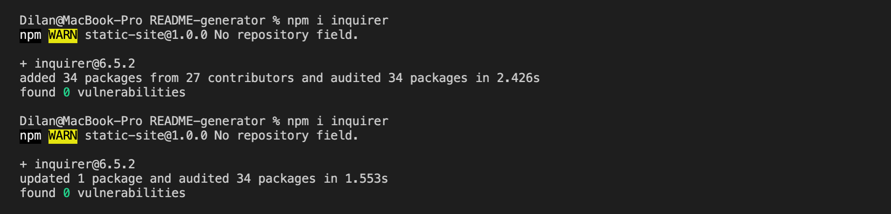

# Sample Title
  

## Description
This is a description of the sample md file  

  ## Table of Contents  
- [Description](#description)
- [Installation](#installation)
- [Usage](#usage)
- [Contributing](#contributing)
- [Tests](#tests)
- [License](#license)
- [Questions](#questions)  

  

## Installation  
clone repository, then open terminal in the corresponding repository, enter npm i inquirer, evoke the application by entering node index.js in the terminal

## Usage
instructions 1, 2, 3

## Contributing
contribution guidelines

## Tests
test 1, 2, 3  

## License
This application is covered under the PDDL license.

## Questions
Please contact me for any aditional questions.  

GitHub: https://github.com/DilanLi  
Email: dilanli0706@gmail.com

  